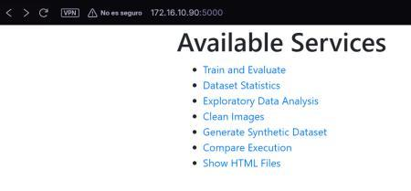
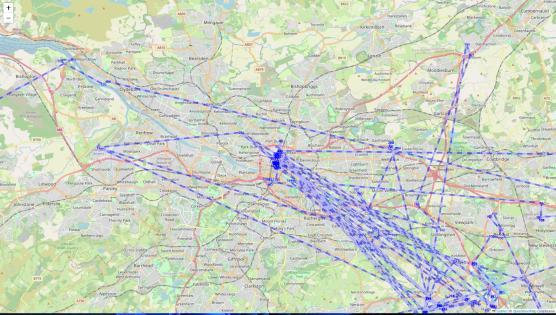
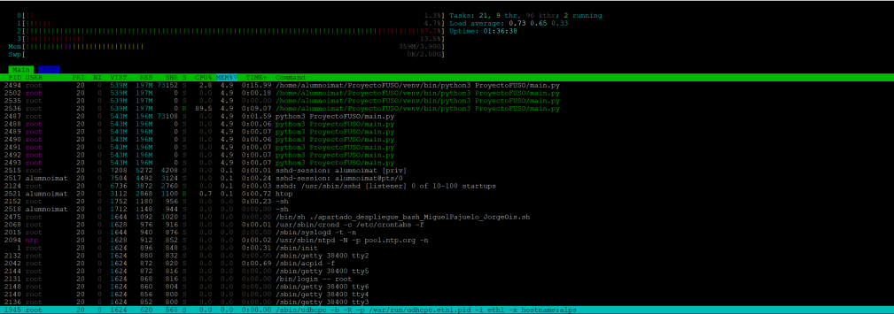
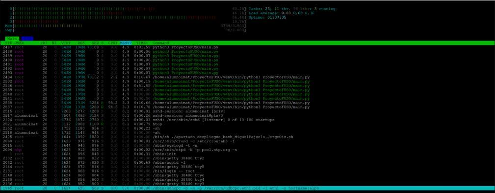
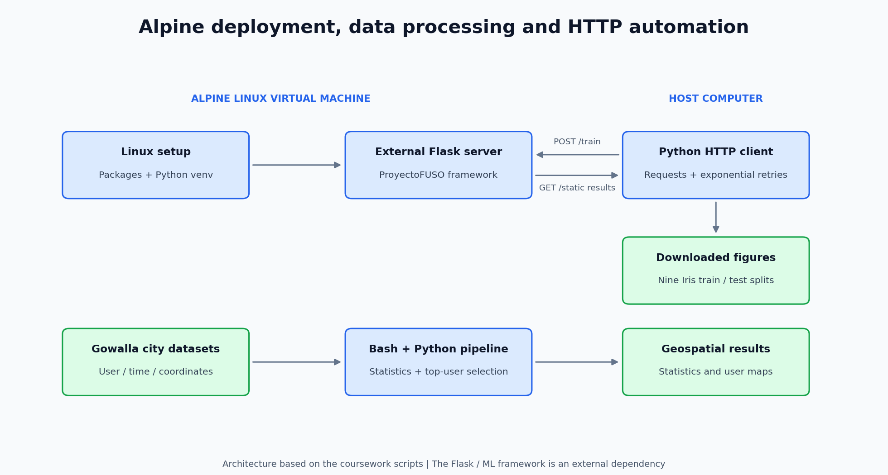
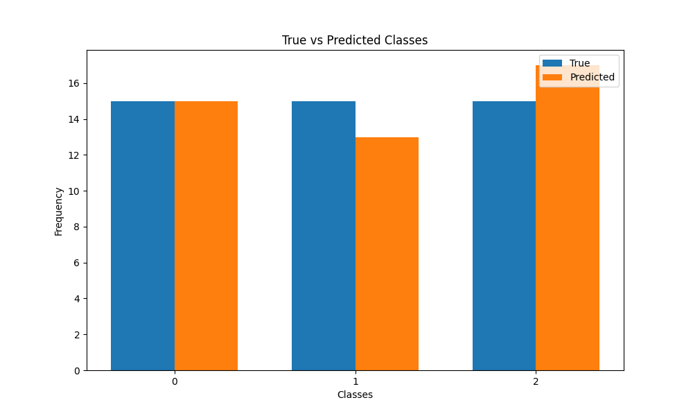
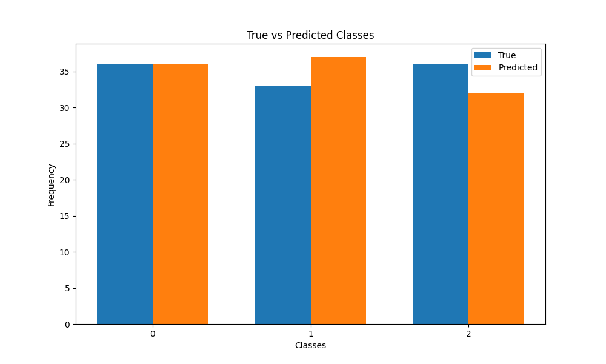
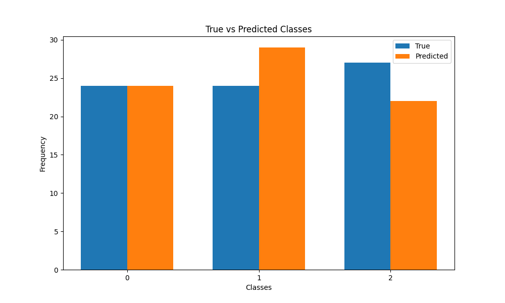
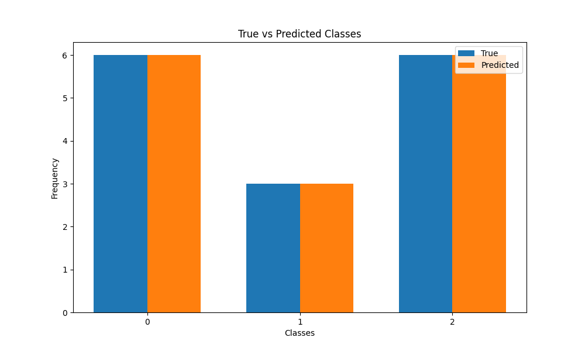

# Automated Flask Deployment on Alpine Linux


**From a minimal Linux virtual machine to a running Flask service, a data-processing workflow and an automated HTTP client.**

Academic project by **Miguel Pajuelo Gómez and Jorge Ois de Pascual** for *Fundamentos de los Sistemas Operativos*, ICAI, Universidad Pontificia Comillas. The coursework combines operating-system setup, shell automation, geospatial data processing and client/server communication.

The Flask/ML server is the external [ProyectoFUSO framework](https://github.com/pablosanchezp/ProyectoFUSO). This repository contains our deployment, processing and communication scripts, together with original submission evidence; authorship of the external framework remains with its creators.

[Usage examples](#the-project-in-use) · [Architecture](#architecture) · [Results](#original-results) · [Run the project](#run-the-project) · [Validation](#validation-and-scope) · [Report](documentacion/memoria.pdf)

## The project in use

The practical goal is to make a minimal Alpine VM usable as a remote application server, then use its services to explore data and retrieve experiment outputs.

| User task | What happens | Visible outcome |
|---|---|---|
| Start the service and open its URL from the host. | The deployed external Flask framework exposes its service catalogue. | A web page with training, statistics, maps and execution-comparison services. |
| Process city check-ins and inspect the generated HTML. | Coursework scripts prepare Gowalla data for the framework's mapping tools. | A geographical view of user check-ins and movements. |
| Run the Python request client. | Nine train/test configurations are submitted, then their figures are downloaded. | A folder of Iris result figures. |

### Web service catalogue



*Original screenshot from the [report, page 3](documentacion/memoria.pdf). This is the external framework's interface as used in the coursework, not a newly designed UI.*

### Gowalla map output



*Original map from the [report, page 5](documentacion/memoria.pdf): Glasgow check-ins and user movements. The image was extracted unchanged. Basemap attribution: [OpenStreetMap contributors](https://www.openstreetmap.org/copyright).*

<details>
<summary><strong>Original CPU monitoring during sequential and parallel execution</strong></summary>

**Sequential execution**



**Parallel execution**



These are historical screenshots from the [report, page 4](documentacion/memoria.pdf). They illustrate the execution-comparison experiment discussed in that report; they are not a new performance benchmark or evidence that the current deployment has been rerun.

</details>

## What the project demonstrates

- **Linux deployment:** preparing Alpine packages, cloning the server and creating a Python virtual environment.
- **Shell data workflows:** processing Gowalla check-ins, computing descriptive statistics and selecting the most active users.
- **HTTP automation:** submitting training requests and retrieving figures for nine train/test splits, with timeouts and exponential retries.
- **Technical communication:** documenting the deployment and experiments in a [report](documentacion/memoria.pdf) and [poster](documentacion/poster.pdf).

## Architecture



The Gowalla processing and Iris training requests are separate coursework workflows. The Iris model is **Random Forest**, supplied by the external server; it is not a model implemented by this repository.

## Original results



*Historical output included in the submission. The bars compare actual and predicted class frequencies; matching totals alone do not establish prediction accuracy.*

<details>
<summary><strong>Compare three original train/test splits</strong></summary>

| 30% train / 70% test | 50% train / 50% test | 90% train / 10% test |
|:---:|:---:|:---:|
|  |  |  |

All nine original figures are available in [resultados/](resultados/). They have not been regenerated for this README.

</details>

## Repository guide

| Entry point | Purpose |
|---|---|
| [Package setup](apartado1_MiguelPajuelo_JorgeOis.sh) | Historical Alpine package installation script. |
| [Server deployment](apartado_despliegue_bash_MiguelPajuelo_JorgeOis.sh) | Clone the external framework, create `.venv` and start Flask. |
| [Gowalla pipeline](apartado3_MiguelPajuelo_JorgeOis.sh) | Process city datasets, calculate statistics and generate maps. |
| [Statistics](stats_checker_JorgeOis_MiguelPajuelo.py) / [Top-N selection](topn_selection_JorgeOis_MiguelPajuelo.py) | Analyse check-ins and rank users. |
| [HTTP client](apartado4_JorgeOis_MiguelPajuelo.py) | Automate nine training requests and figure downloads. |
| [Documentation](documentacion/) / [Results](resultados/) | Original academic deliverables and figures. |

## Run the project

### 1. Prepare the Alpine virtual machine

From a shell with installation privileges:

```sh
apk add python3 py3-pip python3-dev git bash gcc g++ musl-dev linux-headers wget curl unzip
```

The historical package script uses the package name `pip`; current installations may require `py3-pip`, as above. From this repository's directory, start the server:

```sh
sh apartado_despliegue_bash_MiguelPajuelo_JorgeOis.sh
```

The script creates `ProyectoFUSO/` and `.venv/`, both excluded from Git. See [PROCEDENCIA.md](PROCEDENCIA.md) for the external reference and portability adjustments. The server entry point and its dependencies belong to that external repository.

### 2. Run the host-side client

On the host computer, create a Python environment, install `requests`, and set the VM's reachable IP. PowerShell example:

```powershell
python -m venv .venv
.\.venv\Scripts\python.exe -m pip install requests
$env:ALPINE_IP = "IP_OF_THE_ALPINE_VM"
$env:FLASK_PORT = "5000"
.\.venv\Scripts\python.exe apartado4_JorgeOis_MiguelPajuelo.py
```

For a POSIX shell, use `export ALPINE_IP=...` and `export FLASK_PORT=5000`. The VM must be reachable on that port. [.env.example](.env.example) documents the variables; it is not loaded automatically. New downloads go to `descargas_resultados_flask/`, separate from the historical `resultados/` figures.

### 3. Process the Gowalla coursework data

With the external framework cloned, prepare `ElPasoGowalla.txt`, `GlasgowGowalla.txt`, `ManchesterGowalla.txt` and `WashingtonDCGowalla.txt` inside `DatasetsGowalla/`, then run:

```sh
bash apartado3_MiguelPajuelo_JorgeOis.sh
```

The script retains the coursework Google Drive link and accepts `GOWALLA_URL` as an alternative. That link's availability has not been checked. [SNAP's original Gowalla dataset](https://snap.stanford.edu/data/loc-Gowalla.html) explains the user/time/latitude/longitude/place schema; reproducing the coursework files requires the appropriate city filtering.

## Validation and scope

| Checked locally during repository preparation | Requires the deployment environment |
|---|---|
| Syntax of all three shell scripts and the Python scripts. | Booting the Alpine VM and installing its packages. |
| Statistics and Top-N selection with synthetic records. | Processing the complete coursework Gowalla data. |
| Nine POST + nine GET requests against a local mock server. | Training through the real external Flask server. |

The included report also discusses sequential/parallel execution. Historical figures and documentation are preserved as evidence, without claiming a new benchmark or a repeated VM deployment. VM images and submission ZIPs remain in the local coursework archive rather than this repository.

**Further reading:** [validation details](VALIDACION.md) · [provenance and changes](PROCEDENCIA.md) · [original report](documentacion/memoria.pdf).
